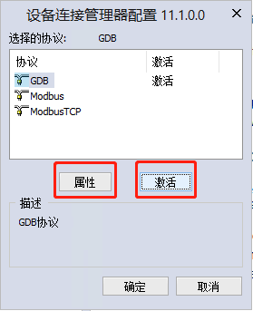
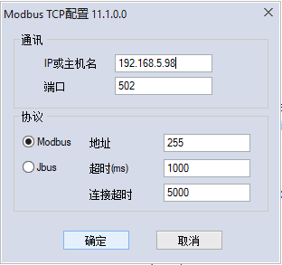

.. _logiclab-basic:

LogicLab操作基础入门
==========================

在深入基于LogicLab应用IEC61131-3编程之前，首先需要熟悉LogicLab编程工具基础操作，本文章节将由浅入深来讲解LogicLab编程工具的基础操作步骤。

.. contents:: 本章节内容目录
   :local:
   :backlinks: none
   :depth: 3

通过在线扫描新建工程
------------------------

目前大部分基于LogicLab解决方案开发的控制器都支持以太网方式下载，对于此控制器产品，LogicLab提供了在线扫描方式可以快速为该控制器创建PLC工程，默认配置好目标控制器类型与通讯参数。用户可以在LogicLab编程工具主界面上点击 ``扫描网络`` 后即可搜索当前局域网内的控制器信息与当前的设备IP地址，并且可以点击 ``新建工程`` 使用当前扫描到的控制器信息创建工程：

.. figure:: images/logiclab_basic/logiclab_basic_01.png
   :align: center

   图1: 在线扫描方式新建工程

   图2: 默认已经勾选目标控制器类型

.. warning::

    如PC第一次安装LogicLab编程工具，并第一次使用 ``扫描网络`` 功能时，Windows系统会提示解除LogicLab编程工具防火墙限定提示，确认后即可正常进行在线扫描。极少数公司的PC机对于网络应用有非常严格的管理，可能在线扫描模式不可用，因此需要通过 `标准模式新建工程`_ 新建工程。

标准模式新建工程
-----------------
标准模式新建工程与在线扫描模式类似，只是需要完全手动选择控制器类型与手动配置通讯参数，主界面 ``新建工程`` 或者菜单 ``文件->新工程`` 来手动选择控制器类型，通过标准模式新建工程，需要自行 `配置通讯参数`_ 。

   图3: 在线扫描方式新建工程

.. figure:: images/logiclab_basic/logiclab_basic_04.png
   :align: center

   图4: 手动选择控制器类型

配置通讯参数
-------------
通过标准模式新建工程时，需要在LogicLab编程工具中指定控制器的IP地址与通讯端口，或者其他通讯参数，通过菜单 ``在线->设置通讯`` 可以打开 ``设备连接管理器`` ,并选择相应的通讯协议，进行参数设定与激活如下图所示：

   图5: 设备连接管理器配置界面

以下分别是三种常用的LogicLab编程工具与控制器之间的调试与下载协议：GDB、Modbus RTU以及Modbus TCP：

.. figure:: images/logiclab_basic/logiclab_basic_06.png
   :align: center

   图6: GDB下载通讯协议配置界面（常用）

.. figure:: images/logiclab_basic/logiclab_basic_07.png
   :align: center

   图7: Modbus RTU下载通讯协议配置界面（小型PLC常用）

   图8: Modbus TCP下载通讯协议配置界面（小型PLC常用）

.. warning::

   无论是通过 `通过在线扫描新建工程`_ 还是通过 `标准模式新建工程`_ ，首先需要确保使用LogicLab编程工具的PC可以与设备正常建立通讯。例如使用以太网功能下载，则需要确保使用LogicLab编程工具的PC与目标设备处于同一个网段，并且可以ping通设备。如果使用串口Modbus RTU协议下载，则需要确保目标设备上是否提供串口下载PLC程序的功能，请与您的硬件供应商进行确认。

工程逻辑元素与设备资源配置
---------------------------

在LogicLab编程工具中，工程逻辑包括程序、功能块、函数、数据类型、任务等等需要在控制器中应用的逻辑元素，并且可以通过右键菜单进行添加。关于任务个数与类型在控制器设计之初就会被固定下来，用户只可以修改其参数而不可以添加或删除，详细任务说明请参阅对应控制器厂商使用说明书的 ``任务定义与管理`` 章节。

.. figure:: images/logiclab_basic/logiclab_basic_09.png
   :align: center

   图9: 工程逻辑界面与可新建的工程逻辑元素

设备资源配置包括I/O信号、系统参数、现场总线、通讯、运动控制等等外部硬件功能，根据控制器设计的硬件外设与功能不同，不同的控制器的设备资源配置界面可能是不同的。LogicLab解决方案自带的现场总线配置可以参考 :ref:`LogicLab现场总线 <logiclab-fieldbus>` 页面，其他由控制器厂商进行二次开发的组件请参考对应控制器厂商使用说明书的 ``设备资源`` 章节。

.. figure:: images/logiclab_basic/logiclab_basic_10.png
   :align: center
   
   图10: 设备资源配置界面

添加编写逻辑的容器 - 程序
--------------------------

``程序（Program）`` 、 ``功能块（Function Block）`` 与 ``函数（Function）`` 是IEC61131-3标准中定义的 ``程序组织单元（POU）`` 的组成基础，用于描述在PLC控制器中运行的逻辑，因此应用开发工程师需要使用程序、功能块或函数来进行工程逻辑编写。

.. note::

    在进行现场应用逻辑开发时，一般情况下，工程师主要创建一个 ``程序（Program）`` ，并在其代码中使用默认工程库中的 ``功能块（Function Block）`` 以及 ``函数（Function）`` 编写对应的应用逻辑。如果工程师期望将现有的逻辑进行二次封装为全新的指令（功能块或者函数），那么才需要在LogicLab中创建 ``功能块（Function Block）`` 以及 ``函数（Function）`` 。关于逻辑代码二次封装，请参考：:ref:`基于LogicLab的IEC61131-3编程指南 <logiclab-iec61131>` 页面。

可以在工程树种右键菜单添加程序，并指定程序所使用的编程语言：
* IL（指令表编程语言）
* FBD（功能块图编程语言）
* LD（梯形图编程语言）
* ST（结构化文本编程语言）
* SFC（顺序功能图编程语言）

同时需要指定程序名称，程序名称必须需要以 ``大小写英文字母`` 开头，搭配 ``数字`` 、 ``半角下划线与中横杠`` 来进行命名。

并且需要对程序指定一个任务，由该任务按照其执行的规则来运行该程序逻辑。添加一个程序如下所示：

.. figure:: images/logiclab_basic/logiclab_basic_iec_prog_01.png
   :align: center
   
   图11: 添加程序

.. note::
    
     ``任务（Task）`` 是执行控制器逻辑的基础，在控制器研发阶段，任务的个数与类型会由控制器厂商根据控制器的定义而开发，从应用角度上来划分，主要可以分为 ``周期型任务`` 与 ``单次执行任务`` 两大类。

程序添加完毕后，可以在工程树中双击该程序打开其变量定义与代码编辑界面，

.. figure:: images/logiclab_basic/logiclab_basic_iec_prog_02.png
   :align: center
   
   图12: 梯形图程序中的基础操作

.. note::

    在 ``程序`` 代码中可以使用 ``功能块与函数`` ，用户创建的 ``功能块`` 中可以使用 ``功能块与函数`` ，用户创建的 ``函数`` 中仅能使用 ``函数`` ，相关调用的关系以及更加详细的编程语言指南，请参阅： :ref:`基于LogicLab的IEC61131-3编程指南 <logiclab-iec61131>` 页面。

工程库中的功能块与函数
----------------------

在开发工程应用逻辑时，可以使用控制器默认提供的工程库，默认的工程库一般是由控制器研发厂商默认配置好，适用于当前控制器并且经过了测试。

这些工程库有即包含IEC61131-3标准中定义的功能块与函数，也有包含控制器厂商根据自己产品需求进行开发功能块与函数。由控制器厂商进行二次开发的工程库请参考对应控制器厂商使用说明书的 ``控制器专用工程库`` 章节。

例如在 ``LogicLab运动控制开发套件`` 中包含如下工程库：

.. figure:: images/logiclab_basic/logiclab_basic_libmgr_01.png
   :align: center
   
   图13: 工程库中的功能块与函数

同时可以打开工程库管理界面或者刷新工程库：

.. figure:: images/logiclab_basic/logiclab_basic_libmgr_02.png
   :align: center
   
   图14: 工程库管理与刷新工程库

工程库管理界面中，可以添加新的或者删除现有工程中的工程库：

.. figure:: images/logiclab_basic/logiclab_basic_libmgr_03.png
   :align: center
   
   图15: 工程库增加与删除

.. note::

    工程库文件命名为 ``*.plclib`` 或者 ``*.pll`` ,目前大多数工程库采用 ``*.plclib`` 命名模式，可以存放更多的工程信息。 ``*.pll`` 格式的工程库为LogicLab早期工程库格式，目前仅仅在一些最基础的系统库中会使用到。

      
全局变量与局部变量
------------------

``变量Variable`` 是IEC61131-3标准吸收现代高级编程思想并且在工业控制领域的实际应用。
 
在LogicLab中可以添加全局变量与局部变量，全局变量可以由当前工程中所有的程序、功能块与函数POU共享与访问，作为不同逻辑之间相互数据交互的桥梁。而局部使用范围仅限于定义该变量的程序、功能块与函数POU范围内使用。

.. note::

   无论是全局变量或者是局部变量，区别仅仅是该变量的作用域，而带有特殊地址的变量一般都使用全局变量。详细变量说明请参考： :ref:`基于LogicLab的IEC61131-3编程指南 <logiclab-iec61131>` 页面。

自定义数据类型
-----------------
   
除了基础数据类型以外，还可以通过基础数据类型组成复杂的结构体或者定义枚举、数组等等额外数据类型。基础数据类型与复杂数据类型详细含义，请参考： :ref:`基于LogicLab的IEC61131-3编程指南 <logiclab-iec61131>` 页面。

通过目录分层管理工程逻辑
------------------------

手动添加工程库
--------------

修改任务参数
-------------

工程编译与下载
---------------
