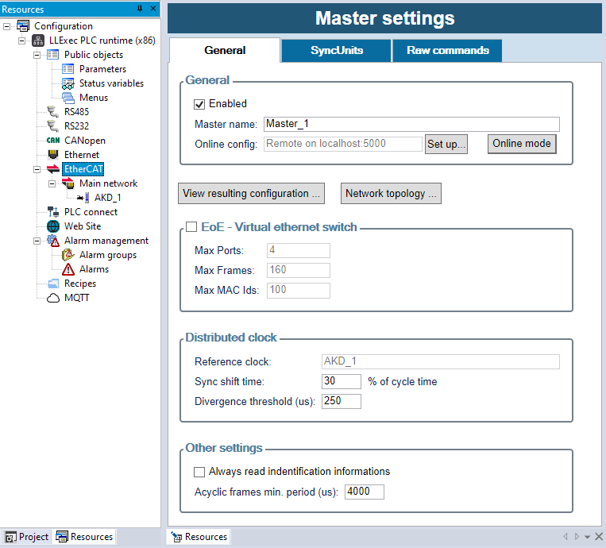

.. _logiclab-fieldbus-ethercat:

EtherCAT现场总线
==================

EtherCAT是高性能工业实时以太网总线，可以通过标准以太网接口将大量I/O模块、伺服驱动器、传感器等等EtherCAT从站设备连接至工业PLC控制器、运动控制器、CNC数控机床、机器人控制器等等设备。

.. contents:: 本章节内容目录
   :local:
   :backlinks: none
   :depth: 3

基本概念
--------------------
EtherCAT从站使用ESI(EtherCAT Slave Information)文件描述，它采用XML格式描述所有的设备特点以及如何与EtherCAT主站通讯。

ESI文件格式由ETG(EtherCAT Technology Group)组织采用的ETG.2000标准进行规范化，单个ESI文件可以包含一个或者多个从站设备与版本，他们通常由从站设备厂商直接提供。

整个EtherCAT网络配置的输出是一个XML文件，需要由EtherCAT主站进行加载与管理，这个配置文件叫做ENI(EtherCAT Network Information)文件。ENI文件格式需要符合ETG.2100标准。

EtherCAT主站与从站之间的通过EtherCAT数据帧进行数据交互，这些数据帧是一些网络上的特殊以太网帧。EtherCAT数据帧由主站出发，经过每一个从站后再回到EtherCAT主站，每一个EtherCAT数据帧都包含一个或者多个EtherCAT命令。
* 周期型数据帧：按照指定周期有EtherCAT主站发出的确定性实时数据帧，包含与所有EtherCAT从站进行交换的过程数据，这些数据以PDOs(Process data objects)方式组织，包含了对象字典的数据值。
* 非周期型数据帧：按需进行发送并且用于实现服务的命令，例如：通过SDOs (Service data objects)读取一次对象字典数据。

EtherCAT网络中经常用到的一个技术是分布式时钟DC(Distributed clock): 让EtherCAT主站与所有从站的时钟完美同步,通常情况下第一个支持DC功能的从站将会被用于整个网络的DC参考时钟, 它将负责同步所有的EtherCAT从站与EtherCAT主站以及EtherCAT主站中PLC的时序。

EtherCAT主站与从站同时都包含状态机用于定义在启动以及运行阶段的状态，它们包括：
* Init: 初始化状态
* Boot: 固件加载、升级或者其他维护状态
* PreOp: 预运行状态，主从站之间没有数据交换
* SafeOp: 安全运行状态, 只有从站到主站的输入数据进行交互
* Op: 正常运行状态, 所有输入与输出的数据交换正常进行

每一个EtherCAT从站包含一个EtherCAT从站控制器ESC(EtherCAT Slave Controller)从站芯片，这个芯片的集成电路遵循EtherCAT总线规范进行通讯管理。

一个ESC包含多个同步管理器SM(Sync Managers)，同步管理器是用于管理过程数据一致性以及内部通过邮箱处理非周期性命令的单元。PDOs需要分配到SM上来进行数据交换；ESI同时也包括现场总线内存管理单元FMMU (Fieldbus Memory Management Unit)，它是内存映射至过程数据逻辑地址区域的单元，同时一个EEPROM用于存储从站设置。

EtherCAT协议同时也定义了很多用于通讯的子协议与设备规约，常见的协议如下：
* CoE: CANopen over EtherCAT。基于EtherCAT协议的CANopen通讯规约
* EoE: Ethernet over EtherCAT。基于EtherCAT协议以太网通讯
* FoE: File access over EtherCAT。基于EtherCAT协议的文件访问
* SoE: Sercos over EtherCAT。基于EtherCAT协议的Sercos通讯规约
* FSoE: Safety over EtherCAT。基于EtherCAT协议的安全通讯规约

快速入门
------------
通过以下步骤可以快速上手EtherCAT总线配置与应用，每一步都将在后续章节详细说明:

1. 通过"Enabled"选择框使能EtherCAT主站

2. 导入所有必要的EtherCAT从站ESI文件（该文件请与EtherCAT从站设备供应商联系）

3. 在主站的"Main network"中添加所有从站设备, 或者启动Online在线模式进行在线"Scan network"功能

4. 通过手动或者在线模式配置从站slot以及modules（如果当前从站设备不存在slot以及modules配置，请忽略此步骤）

5. 配置分布式时钟DC与控制器支持的总线周期

6. 配置PDO以及关联PLC变量与PDO对象

7. 编译与下载工程使得EtherCAT配置生效

导入ESI文件
------------
为了配置EtherCAT网络，第一步需要做的就是导入所有您需要使用的从站设备ESI文件。

为了导入ESI文件，需要选择目录 ``工具/导入ESI`` ，然后从文件系统中选择并导入一个正确的ESI文件，并在ESI设备列表中选择需要导入的一个或者多个设备。

.. figure:: images/logiclab_fieldbus/ethercat/logiclab_fieldbus_ethercat_1.jpg
   :align: center

   从ESI文件导入

ESI文件通常是以.xml格式为扩展名的文件，但是需要注意的是一个主ESI文件中可能内部链接了若干包含了设备描述的子ESI文件，需要与您的设备供应商确定该ESI文件的组成。

EtherCAT主站配置
----------------
在资源窗口里面点击EtherCAT节点，打开EtherCAT主站设置窗口，在这里您可以设置所有的EtherCAT主站参数。.

通用设定选项卡
^^^^^^^^^^^^^^^^

   EtherCAT参数设定选项

* Enabled: 全局开启使能EtherCAT网络以及生成ENI输出文件
* Master name: 可选EtherCAT主站的描述信息
* Online config / Set up...: 配置在线通讯参数，参考章节
* Online config / Online mode: 切换在线连接模式，参考章节
* View resulting configuration: 显示输出ENI文件的预览信息
* Network topology: 显示EtherCAT从站物理连接图形拓扑图
* EoE - Virtual network switch: 使能"Ethernet over EtherCAT"功能，可通过EtherCAT主站在EtherCAT数据帧上传输标准以太网报文
* Max ports: 最大虚拟以太网端口数，该端口数量表示在EtherCAT网络上支持的EoE从站设备个数
* Max Frames: 用于临时存储事件的内部队列大小
* Max MAC Ids: 需要大于连接在网络中的最大以太网设备个数
* Reference clock: 如果有一个或者多个分布式时钟激活，此处仅仅显示作为SYNC Master的从站设备（通常为该网络中第一个支持DC功能的从站）
* Sync shift time: SYNC0信号偏移值，通常以周期时间的百分比显示，如果不确定该值含义，请使用默认值
* Divergence threshold: 最大允许的Master时钟与Sync Master时钟的差值阈值
* Always read identification informations: 如果激活该功能，所有从站的数据(包括VendorID, ProductCode, RevisionNo, SerialNo)将会在启动过程中读取；否则这些数据只会在特定开关打开时进行读取，获取到的数据将存放在在PLC诊断结构体中

SyncUnits选项卡
^^^^^^^^^^^^^^^^

A SyncUnit describes a set of process data that should be exchanged synchronously and consistently between the master and one or more slaves; to do this, for each SyncUnit a separate cyclic EtherCAT command will be sent by the master.

Here you can create SyncUnits, and manually assign each slave to a different SyncUnit.

Raw commands选项卡
^^^^^^^^^^^^^^^^^^^^^

Here you can manually enter a list of raw EtherCAT commands that will be cyclically sent by the master, and assign its "Data in" and "Data out" to PLC variables if needed.

Note that this is an advanced feature: usually the cyclic commands are automatically composed from the exchanged variables of the slaves.

Tasks and cycle time
^^^^^^^^^^^^^^^^^^^^^

Process data is exchanged between master and slaves with cyclic EtherCAT frames; when the EtherCAT master works together with a PLC, they will be sent on the network synchronously with the Fast PLC task, so it is important to correctly configure the period of it:
to do this, right-click on ``Tasks / Fast`` in the ``Project`` tab, choose ``Task configuration`` , set ``Set period=Yes`` and enter the desired period in milliseconds.

.. figure:: images/logiclab_fieldbus/ethercat/logiclab_fieldbus_ethercat_3.png
   :align: center

   任务与EtherCAT周期

If the EtherCAT configurator is instead used stand-alone without a PLC, there will be an additional  ``Tasks`` tab where you can configure the "Default cycle time" and optionally a list of cyclic tasks, that you can manually assign to SyncUnits to send different cyclic frames with different periods.

Every EtherCAT slave on the network will exchange process data with an I/O cycle time that must be multiple of this base cycle time.

EtherCAT网络与HotConnect组
---------------------------------

The EtherCAT master always has a Main network under it, that contains all the mandatory slaves in the EtherCAT network.

Each slave with more than 2 ports can also have up to 2 sub-networks, so more complex and non-linear topologies of the EtherCAT network can be created; in this case they will be shown under each slave.

However a number of groups of optional slaves can be also created: they are called HotConnect groups, because each group could not be present at startup and then connected (or disconnected) later from the network:
to add them, right-click on the "EtherCAT" node of the master, and then "Add HotConnect group".

Please also note that each HotConnect group will need a separate SyncUnit, and if DC is used the "sync master" must be in the main network.

To add an EtherCAT slave under a Network or a HotConnect group, right-click on it and choose "Add", or click on it and then drag&drop the slave from the "Catalog" bar.
If the "Catalog" bar is not visible, you can show it by choosing "View / Tool windows / Catalog" command; all the slaves that are compatible with the type of the selected network will be shown in the catalog.

The "Catalog" bar will shown only the LAST version of each slave device; to show also ALL older versions, use right-click and "Add", and then enable "Show all versions".

.. figure:: images/logiclab_fieldbus/ethercat/logiclab_fieldbus_ethercat_4.png
   :align: center

   任务与EtherCAT周期

从站配置
-------------

By clicking on each EtherCAT slave node in Resources tab, the Slave settings window will be opened. Here you can configure all the settings of the selected slave.

Right-clicking the slave on the tree also shows additional commands, like "Copy", "Cut", "Move up", "Move down", "Export to file".

通用选项卡
^^^^^^^^^^^^^^

.. figure:: images/logiclab_fieldbus/ethercat/logiclab_fieldbus_ethercat_5.png
   :align: center

   任务与EtherCAT周期

* Enabled: enables the usage of this slave; otherwise will be ignored
* Slave name: unique name of the slave in the EtherCAT network
* Auto incr address: automatically generated address, that will be used internally by EtherCAT commands; first slave has address 0 and then backwards, depending of the slave position in the network
* Physical address: address of the slave that is indipendent from its position on the network; if "Manual cfg" is not enabled, will be automatically generated from 1001, otherwise can be manually entered
* Previous port and Output port: they depend from the network topology; EtherCAT port are usually labelled from A to D (but the EtherCAT frame will follow the ADBC route), and the output port is the last port (in the frame route order) of the same type of the input port. The next slave connected to the output port will be shown as "sibling" in the project tree
* Device info: here you can see various informations from the ESI file, and enable mandatory identity checks (on VendorID, ProductCode, RevisionNo, SerialNo) on the slave at startup
* On the first slave of each HotConnect group, it is mandatory to enable the "Check identification" (with any of the 3 supported methods, tipically the "Station alias", that can be written to EEPROM with Online mode, see below), and optionally the "Check previous slave address" can be enabled to "fix" the position of the group inside the network, after a specific physical address; it this check is not used, the HotConnect group can be positioned anywhere inside the main network
* Watchdog: advanced settings of the watchdog features of the slave; to disable a watchdog set its value to zero
* Timeouts for state machine: timeouts in ms for the various transitions of state machine, between: Init, PreOp, SafeOp, Op
* Use LRD/LWR instead of LRW: if enabled, the optimized LRW command (both read and write, not supported by every slave) will not be used, and two simple LRD (read) and LRW (write) commands will be used instead

Startup选项卡
^^^^^^^^^^^^^^

This tab is available only if the slave has CoE support.

   启动命令配置

* PDO assignment: enable it to allow editing of the "Assigned SM" column in "Input" and "Output" tabs, and then download the assignments at startup
* PDO configuration: enable it to to allow editing of PDOs and PDO entries configuration in "Input" and "Output" tabs, and then download the configuration at startup
* Add startup cmd: adds a startup command, that is writing the value of a CoE object at specified state transitions. You can freely enter index/subindex of the CoE object to write, or pick one from object dictionary of the ESI file

输入与输出选项卡
^^^^^^^^^^^^^^^^^^

These two tabs (available only if the slave has CoE support) show the actual configuration of PDOs and PDO entries, that compose the process data of the slave, and their assignmento to PLC variables.

Each PDO has an unique Index, and contains a number of PDO Entries; a PDO entry contains a reference to a CoE object to exchange (given its Index and SubIndex in the dictionary of the slave). Only PDOs assigned to a SyncManager will be included in the process image; PDOs not assigned to a SM will not be exchanged at all.

Input PDOs contain data read from the slave to the master, and Output PDOs data written from the master to the slave.

.. figure:: images/logiclab_fieldbus/ethercat/logiclab_fieldbus_ethercat_7.png
   :align: center

   启动命令配置

* Assign / UnAssign: choose (or remove) a PLC variable to a specific PDO entry; the PLC variable must already exist in the PLC project, be declared as "Automatic", and have the same size of the PDO entry
* Show only assigned PDOs: if enabled, only PDOs that are assigned to a SyncManager (with the "Assigned SM" column) will be shown in the grid
* Add PDO / Delete PDO: add (or remove) a PDO. "Download PDO configuration" in "Startup" must be enabled
* Add PDO Entry / Delete PDO Entry: add (or remove) a PDO entry in a PDO, that must not be "Fixed"; "Download PDO assignment" in "Startup" must be enabled. You can freely enter index/subindex/type of the CoE object to read or write, or pick one from object dictionary of the ESI file
* Assigned SM: SyncManager that will manage and exchange this PDO
* Fixed: if true, a PDO can not be edited
* Mandatory: if true, a PDO can not be deleted or unassigned from its SM
* PLC var column: instead of choosing an existing PLC variable with the "Assign" button, you can also freely enter its name here; if the variable does not exist, will be automatically created

Mailbox选项卡
^^^^^^^^^^^^^^^^^

This tab is available only if the slave has mailbox support.

* Bootstrap specific cfg: advanced settings to alter the mailbox configuration at bootstrap phase
* Mailbox polling: advanced settings for mailbox polling
* EoE - Virtual ethernet port: if the slave supports EoE (Ethernet over EtherCAT), here you can configure its IP parameters

分布式时钟DC选项卡
^^^^^^^^^^^^^^^^^^^^

This tab is available only if the slave has Distributed clock support.

.. figure:: images/logiclab_fieldbus/ethercat/logiclab_fieldbus_ethercat_8.png
   :align: center

   分布式时钟DC参数配置

* Operation mode: you can choose from here any of the predefined DC operation mode (from ESI file); if the predefined mode has been manually modified, "Customized settings" will be checked
* DC Enabled: enables the DC for this slave
* SYNC 0: advanced settings and tuning of the SYNC 0 signal, that is the event when process data is applied: read of the input and actualization of the output
* SYNC 1: advanced settings and tuning of the SYNC 1 signal, that is a device-dependent secondary event
* Assign to local uC: assign the generation of SYNC signal to local CPU, instead of using DC from the network

Slots模块选项卡
^^^^^^^^^^^^^^^^^^^^

This tab is available only if the slave has modules/slot.

   Slot模块参数配置

* Slots list (left pane): this is the list of all available slots to be configured on the target, eventually with a grouping
* Modules list (right pane): when you select a slot of the left, here all compatible modules with that slot will be shown. Choose "Assign module to a slot" or double-click it to assign.
* Up: moves up the selected slot, preserving assignments of PLC vars
* Down: moves down the selected slot, preserving assignments of PLC vars
* Read all slots cfg: when Online mode is active, try to auto-detect all the slots configuration from the slave

When a module is assigned to a slot, additional CoE dictionary objects, statup commands, or PDOs could be automatically added to the base slave configuration.

EtherCAT主站在线模式
----------------------

It is possible to connect the EtherCAT configurator to the EtherCAT network, for debugging and diagnostic purposes.

First of all, the Online mode must be configured, by choosing "Online config / Set up..." in the "Master settings" window. You can choose between:

* Remote (GDB): EtherCAT master will be normally running on the remote target, with the EtherCAT network connected to him. This should be the preferred connection mode for debugging, because does not alter the behaviour of the master and of the network
* Gateway: EtherCAT master must not be running on the remote target, and a local EtherCAT master on the PC will be used; the EtherCAT network is physically connected to the remote target, that will only act as a "gateway" to dispatch EtherCAT frames to/from the PC
* Local: a local EtherCAT master on the PC will be used, and the EtherCAT network must be physically to a local Ethernet port of the PC; this requires the installation of the WinPCAP library on the PC, that can be download from here

Once the Online mode has been set up, you can toggle the "Online mode" button to activate it; an additional "Online" tab will appear.

   EtherCAT主站在线模式

* Scan network: auto-detects all connected EtherCAT slaves on the network. If the current project is empty, all slaves will be automatically added; otherwise a dialog will be shown (see below). Please note that you must already have imported ALL the necessary ESI files in the catalog to successfully complete the network scanning
* Run: toggles the running state of the master
* Req. state: changes the requested running state of the master; changing the state of the master will also change the state of ALL slaves
* Actual state: show the actual running state of the master
* Slaves list: shows a resume of all the slaves, with their addresses and actual running state

.. figure:: images/logiclab_fieldbus/ethercat/logiclab_fieldbus_ethercat_11.png
   :align: center

   扫描网络

This is a sample result of the scan: a dialog with two panes, with the scan results on the left and the current configuration on the right, to manually choose which slaves you want to add to the project.

Please note that "Copy selected" will copy the selected slave on the left AFTER the selected slave on the right, so a selection in both panes must be done.
   
With respect to their position, different slaves are shown in red, matching slaves in black, and missing slaves in blue.

EtherCAT从站在线模式
----------------------

When Online mode is active, an additional "Online" tab will appear also on each slave.

.. figure:: images/logiclab_fieldbus/ethercat/logiclab_fieldbus_ethercat_12.png
   :align: center

   EtherCAT从站在线模式

* ESC register access: opens a dialog to read/write values of one or more ESC registers, given its well-known name or freely by index

   ESI寄存器

* EEPROM access: opens a dialog to read/write values of EEPROM registers, given its well-known name or freely by index; this is particularly useful to set the "Station alias" if you are using "HotConnect groups"

   EEPROM访问

* COE SDO access: opens a dialog to read/write values of one or more CoE objects, by browsing the object dictionary of the slave

.. figure:: images/logiclab_fieldbus/ethercat/logiclab_fieldbus_ethercat_15.png
   :align: center

   COE SDO访问

* Diagnostics: opens a dialog that shows diagnostic informations of the slave, internal error codes and physical ports status

   诊断

* FoE transfer: if the slave supports FoE ("File over EtherCAT"), opens a dialog to execute file upload to the slave; this is can be used for firmware upgrade, parameters upload, etc.
* Req. state: changes the requested running state of the slave; this could be different from the actual state of the master
* Actual state: show the actual running state of the slave
* PDO entries list: shows a resume of all the PDO entries, with their current value; double-click on the "Value" column to manually change the value (just once), or enable the "Forced" column if you want to apply the new value permanently. Works for both input and output PDOs

EtherCAT诊断功能
--------------------

The EtherCAT Master reads two configuration files generated by EtherCAT configurator:
* An ENI file, EtherCAT Network Information, which is a standardized description of the network, that is the output of the EtherCAT configurator
* An XML configuration file, describing the mapping of PLC I/O variables with PDO Entries; this file includes some other master parameters
At start-up, the master first interprets the ENI, which is sufficient to make a network operable, perhaps for debugging purposes, then reads the configuration XML, opens the communication port, and waits to see the link on that port.

As soon as the link is detected, the master:
* it starts sending packets on the network with the timing required
* synchronizes the system clock: in case of configuration with distributedclock, the whole system must be synchronized at network time.

Under normal operating conditions, there are some start-up phases before the network becomes operative: all slave configurations are sent by init commands, these commands carry some specific configurations for each slave. Each slave will step through the following states:
* INIT: initialization phase
* PREOP: pre operational, no data-exchange occur between master and slaves
* SAFEOP: safe operational, only input data from slaves to the master are exchanged
* OP: operational, full data-exchange can happen

If Distributed clock is used, all slaves operating in distributed clock must synchronize their clocks with that of the sync master.
The EtherCAT master must also be synchronized to the network clock, and with it the I/O task cycle and a number of connected activities.
Managing the distributed clock on the master takes place in some phases:

* IDLE: The master clock is completely independent from the slaves
* SYNCHRONIZING: The master is making preliminary measurements to synchronize with the slaves
* WAITING_START_TIME: After the master has synced with the slaves, you have to wait for the START_TIME, which is the first time the slaves implement I/O
* COMPENSATING: If the master clock is synchronous with that of the slaves and after START_TIME has passed, the management goes into this state, which means that the Master is constantly tracking the clocks of the network, in this state typically all slaves are in OP state
* NOT_SYNCHRONIZED: If for any reason the master fails to follow the network clock, then management goes into this state and all the slaves involved go to the SAFE_OP state.

Some master and slave diagnostic structures provide information about the states discussed above inside the PLC.
In these structures and their functions one can refer to a slave in two different ways:

* Using the index, positional on the EtherCAT network, the index starts from 0
* Using a physical address, which can also be selected by the user during configuration

In addition to diagnostic structures, the Master stack can trigger events that can be detected by the PLC application and other plugins in terms of callbacks or callback tasks invocation. Events can typically be:

* the status change of slaves,
* communication errors,
* emergency CoE messages,
* distributed clock status variation,
* resync events, which occur when the slaves or the entire network are ready to go into operating mode,
* and finally the network recovery event, which indicates a reboot of EtherCAT communication to deal with a serious error case.

When an event occurs, that event triggers:
1. updating diagnostic structures related to that event
2. invoking callback functions for registered plugins
3. the execution of the special plc task ECAT_Notify, which can be used to read the updated diagnostic structures
4. as an alternative to the ECAT_Notify task, there is also the ECAT_Resync task, that is invoked at the first time that a node or the whole network goes into operating mode: this allows the PLC programmer to perform additional slave configurations by sending and receiving SDOs.

诊断数据结构体参考
-----------------------

This chapter describes the diagnostic structures offered by EtherCAT stack and published in the EtherCAT.pll:

* A variable called sysEcatMasterStatus, type ECATMASTERSTATUS, allowing you to have a general view of the status of the EtherCAT network
* A variable called sysEcatSlaveMonitor, type ECATSLAVEMONITOR, which can be placed in Watch on LogicLab to monitor the particular status of any slave
* A set of variables associated with events that can be used by the PLC to react to changes in the status and errors of the EtherCAT network:
  1. sysECATEventId, type ECATEVENTID, containing the ID of the last encountered event
  2. sysECATEmcyEvent, type ECATEMCYEVENT: this structure contains information about the last Emergency event sent by a CoE slave
  3. sysECATErrorEvent, type ECATERROREVENT: this structure gives information about the last error event detected on the EtherCAT
  4. sysECATNetworkRecoveryEvent, of type ECATNETWORKRECOVERY: this structure refers to the last event of NetworkRecovery
  5. sysECATNodeStatusChangedEvent, of type ECATNODESTATUSEVENT: this structure gives information about the last change of status of a slave
  6. sysECATDCStatusChangedEvent, of type ECATDCSTATUSEVENT: this structure gives information about the last variation of the master state, related to its synchronization with the Distributed Clock as shown in the overview, these variables can be consulted within the special tasks ECAT_Notify and ECAT_Resync, they can also be watched in LogicLab for more detailed information about events occured.

* A set of functions to access the slave diagnostic structures, containing the same information as the SlaveMonitor; they can refer to the physical address of the node (ByAddress version), or to the location index of the node in the network, starting from index 0 (ByIndex version):
  1. sysECAT_GetSlaveDiag [ByAddress | ByIndex]: Returns a pointer to the diagnostic structure (@ECATSLAVESTATUS), or NULL if the function fails
  2. sysECAT_GetSlaveCfg [ByAddress | ByIndex]: Returns a boolean value whether the required slave has been configured or not
  3. sysECAT_GetSlavePres [ByAddress | ByIndex]: Returns a boolean value indicating the presence, if the slave is physically connected
  4. sysECAT_GetSlaveState [ByAddress | ByIndex]: Returns the slave network status (ECATSTATE)

* Two function blocks for read and write SDO; they can be used to read or write objects to perform checks from PLC, or to do auxiliary configurations after the network has entered the operating mode:
  1. sysECAT_Sdo_Read
  2. sysECAT_Sdo_Write

For further details and descriptions of all the fields, please see the "Properties" window inside LogicLab of each object of the EtherCAT.pll library.

问题分析与FAQ
-----------------------

What happens if the drives_clock field of the diagnostic structure of the master becomes FALSE?
This field indicates that a timeout has occurred such that the LLExec clock has been released from the EtherCAT Clock: typically this can happen when communication between the Master and the first slave fails due to, for example, the first cable interrupted or of a fault in the first slave.

What happens if one or more nodes are not present or stop working?
In the event that the fault is located in the first slave, the most common symptom is that the drives_clock flag in the master's structure becomes false.
In the case of fault located in other nodes, it depends on whether they are present during the network startup phase or not:
if there are missing nodes in the startup phase the network will not go beyond the INIT state, you can use the SlaveMonitor to see which is the first node that presented an error or is missing.
In case the network has already gone into operational, the field network_ok of the master becomes false, you can use the SlaveMonitor to check which slave is missing, or have submitted an error.
Attention: if a slave stops working, the other slaves may remain in operating status: it is therefore the task of the application to reset the outputs or take appropriate actions.

What happens if the network_ok field of the diagnostic structure of the master becomes FALSE?
network_ok becomes TRUE when all the slaves go into operating mode, it returns FALSE if a slave is no longer present, or has shown an error.
You can use the SlaveMonitor, to be able to identify the slave that is not present, or the one that has shown an error.

What happens if less slaves are configured than those actually present in the network?
The network will not go into operation, apparently all the slaves do not report errors, so you can look at the sysECATErrotEvent structure to check if there are any errors not related to the configured slaves:
in this case you will see the error K10063_MASTER_SLAVES_COUNT

