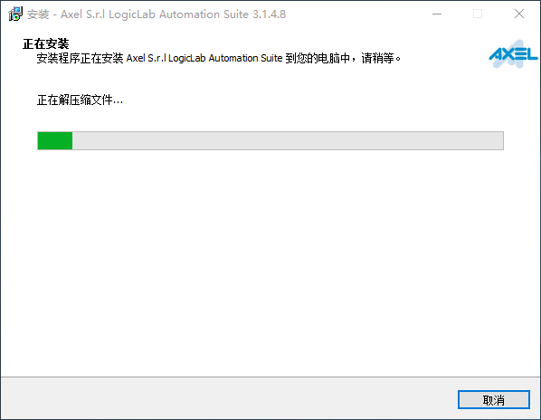

.. _logiclab-install:

LogicLab编程工具下载与安装
==========================

LogicLab编程工具下载与安装是第一步准备工作，用户需要进入翌控科技官网下载中国版本的LogicLab编程工具，并在Win10以上版本电脑上进行安装（Win7操作系统需要安装IE11组件，以便于正确显示LogicLab编程工具中的网页界面）

.. contents:: 本章节内容目录
   :local:
   :backlinks: none
   :depth: 3

下载LogicLab编程工具
--------------------
LogicLab编程工具可以在翌控科技官网上(https://www.nxtrol.com/download.html)下载，注册登录完毕后即可进行下载：

.. figure:: images/logiclab_install/logiclab_install_1.png
   :align: center

   图1: LogicLab编程工具下载页面

.. warning::

    推荐使用Win10操作系统安装LogicLab编程工具，同时安装LogicLab编程工具需要管理员权限以及关闭部分防护软件。另如需要基于Win7系统安装，则推荐安装IE11组件，以便于正确显示LogicLab编程工具中的网页界面。

安装LogicLab编程工具
--------------------
进入安装界面后选择同意License条款点击 ``下一步``：

   图2: 授权条款

选择安装目录路径，并点击 ``下一步``：
   

   图3: 安装路径

选择期望安装的组件，并在后续页面使用默认配置点击 ``下一步`` 继续安装：
   

.. figure:: images/logiclab_install/logiclab_install_4.png
   :align: center

   图4: 组件选择

等待安装进度条完成：

   图5: 等待安装进度

成功完成安装：

.. figure:: images/logiclab_install/logiclab_install_6.png
   :align: center

   图6: 完成安装页面

双击桌面``LogicLab``快捷方式即可启动LogicLab编程工具：

   
   图7: LogicLab编程工具启动主界面

安装故障分析FAQ
---------------
1. 极少数Win10系统禁止了系统的临时目录的权限，安装LogicLab编程工具时，微软Visual C++ 2017 Redistributable组件安装会出现失败情况，最终安装过程表现如下：

.. note::

    目前仅仅在ThinkPad X13锐龙版笔记本电脑系统中发现该情况，需要独立安装翌控科技提供的vc_redist.x86.exe软件，确认成功后，再安装LogicLab编程工具即可。
    
.. figure:: images/logiclab_install/logiclab_install_faq_1.png
   :align: center

   图8: 注册失败

2. LogicLab编程工具依赖微软的.Net Framework组件，目前最新版本为4.7.2，LogicLab会将该组件打包至LogicLab编程工具安装包中进行后台默认安装，如果该组件出现故障，LogicLab可能无法正常运行。

